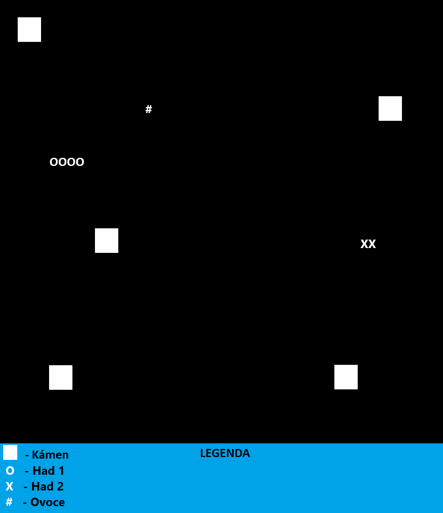
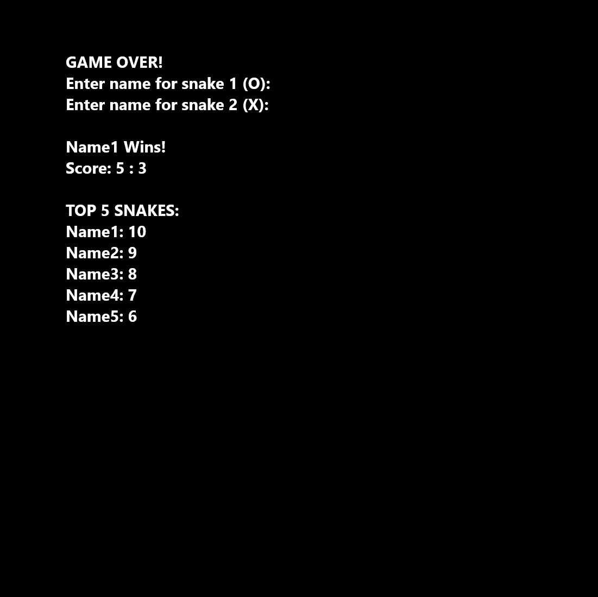

 # Videohra v CLI: Salám a Belinka - Funkční požadavky
* *SSPŠ*
* *Verze 1*
* *Václav Bohdanecký*
* *17.9.2024*

## Obsah
1. Historie Dokumentu
2. Úvod
3. Celková hrubá architektura
4. Hlavní obsah aplikace
5. Účel programu

## Historie Dokumentu
### Verze 1
* **Autor:** Václav Bohdanecký
* **Komentář:** První verze dokumentu

## Úvod
* **Účel dokumentu** – Účelem dokumentu je popsání všech požadovaný funkcí programu a nefunkčních požadavků.
* **Kontakt:** bohdanecky.va.2022@skola.ssps.cz

## Celková hrubá architektura
* **Jazyk aplikace:** Angličtina
* **Spuštění:** Hned po spuštění se otevře konzole a hráč je vtáhnut do hry, která okamžitě začíná
* **Výchozí nastavení:** 
    * 10% pole budou kameny
    * Had se posouvá o 1 symbol

## Hlavní obsah aplikace

### Návrh user interface
#### Hlavní hra

#### Konec hry

### Herní pole
Velikost konzole odpovídá velikosti hracího pole, na kterém se hráč musí udržet, jinak prohrál.

### Hadi
Na herním poli jsou dva hadi a ti začínají naproti sobě a jezdí po poli bez přestávky. Had **Salám** (O vlevo) se ovládá klávesami ``WASD`` a had **Belinka** (X vpravo) se ovládá ``↑←↓→``. Pokud do sebe hadi narazí, tak hra končí.

### Kameny
Kameny jsou náhodně rozmístěné symboly na hracím poli. Pokud had narazí do kamene, tak **hra končí**. Kamenů je vždy stejně, ale jsou na jiných místech.

### Ovoce
Hadi mají za úkol pozbírat co nejvíce **ovoce (#)** jen jde. Po pozřetí **ovoce** se had zvětší o **jeden symbol (O nebo X)**. 

### Skóre
Na konci kola se zeptá program na jméno obou hadů a připíše jim jejich **skóre (počet pozřetého ovoce)**, persistentně uloží a vypíše pět nejlepších hadů za celou dobu, co hra existuje.

## Účel programu
### Rivalita
* **2 hráči**

Hra se dá hrát s protihráčem a hráč bude mít tedy buď ``WASD`` anebo ``↑←↓→``. Hráči se tedy předhání kdo bude mít **větší skóre**.

### Zlepšení dělené pozornosti a multi-taskingu
* **1 hráč**

Hra se dá ovšem hrát v jednom, ale už nejde o soutěž, ale o výzvu. Důležité je **udržet oba hady v herním poli**, **nenarazit** a **nasbírat co nejvíce ovoce**. V této výzvě hráč ovladá jednoho hada levou rukou klávesami ``WASD`` a zárověň druhého hada pravou rukou klávesami ``↑←↓→``.
